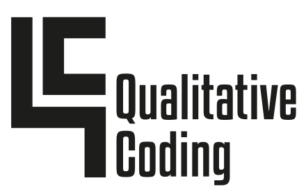

# Qualitative Coding

`qc` is a free, open-source command-line-based tool for qualitative data 
analysis designed to support computational thinking. In addition to making the 
qualitative data analysis process more efficient, computational thinking can 
contribute to the richness of subjective interpretation. The typical workflow
in qualitative research is an iterative cycle of "notice things," "think about 
things," and "collect things" (seidel, 1998). `qc` provides
computational affordances for each of these practices, including the ability to 
integrate manual coding with automated coding, a tree-based hierarchy of codes
stored in a YAML file, allowing versioning of thematic analysis, and a powerful
query interface for viewing code statistics and snippets of coded documents. 

Qualitative data analysis, in its various forms, is a core methodology for 
qualitative, mixed methods, and some quantitative research in the social 
sciences. Although there are a variety of well-known commercial QDA software 
packages such as NVivo, Dedoose, Atlas.TI, and MaxQDA, they are generally 
designed to protect users from complexity rather than providing 
affordances for engaging with complexity via algorithms and data structures. 
The central design hypothesis of `qc` is that a closer partnership between
the researcher and the computational tool can enhance the quality of QDA.
`qc` adopts the "unix philosophy" (McIlroy, 1978) of building tools which do 
one thing well while being composable into flexible workflows, and the 
values of "plain-text social science" (Healy, 2020), emphasizing 
reproducability, transparency, and collaborative open science. 

`qc` was used in [a prior paper](https://chrisproctor.net/research/proctor_2019_defining/)
and the author's doctoral dissertation; `qc` is currently a core tool supporting a large 
NSF-funded Delphi study involving multiple interviews 
with forty participant experts, open coding with over a thousand distinct 
codes, four separate coders, and several custom machine learning tools 
supporting the research team with clustering and synthesizing emergent themes.
`qc` is a free, open-source command-line-based tool for qualitative data analysis
designed to support computational thinking. In addition to making qualitative data 
analysis process more efficient, computational thinking can contribute to the richness 
of subjective interpretation. Although numerous powerful software packages exist 
for qualitative data analysis, they are generally designed to protect users from complexity 
rather than providing affordances for engaging with complexity via algorithms and 
data structures. 

## Installation

`qc` is distributed via the Python Package Index (PYPI), and can be
installed on any POSIX system (Linux, Unix, Mac OS, or Windows Subsystem
for Linux) which has Python 3.9 or higher installed. If you want to install
`qc` globally on your system, the cleanest approaach is to use 
[pipx](https://pipx.pypa.io/stable/). 

    pipx install qualitative-coding

If your research project
is already contained within a Python package and you want to install `qc` 
as a local dependency, simply add `qualitative-coding` to `pyproject.toml`
or `requirements.txt`.

`qc` relies on [Pandoc](https://pandoc.org/) for converting between file formats, 
so make sure that is installed as well. `qc` uses a text editor for coding; 
you should install Visual Studio Code, the default editor, unless you prefer
a different editor such as emacs or vim.

## Usage

Please see the [package documentation](https://qualitative-coding.readthedocs.io) 
for details on the design of `qc`, a vignette illustrating its usage, and full 
documentation of `qc`'s commands. 
